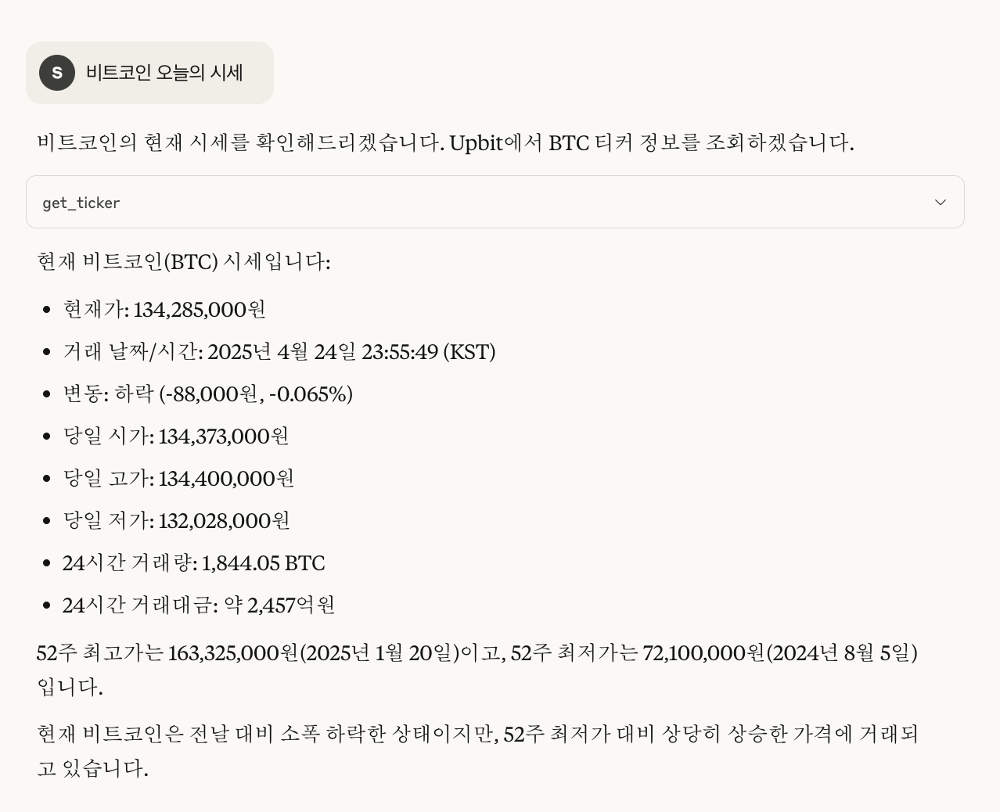
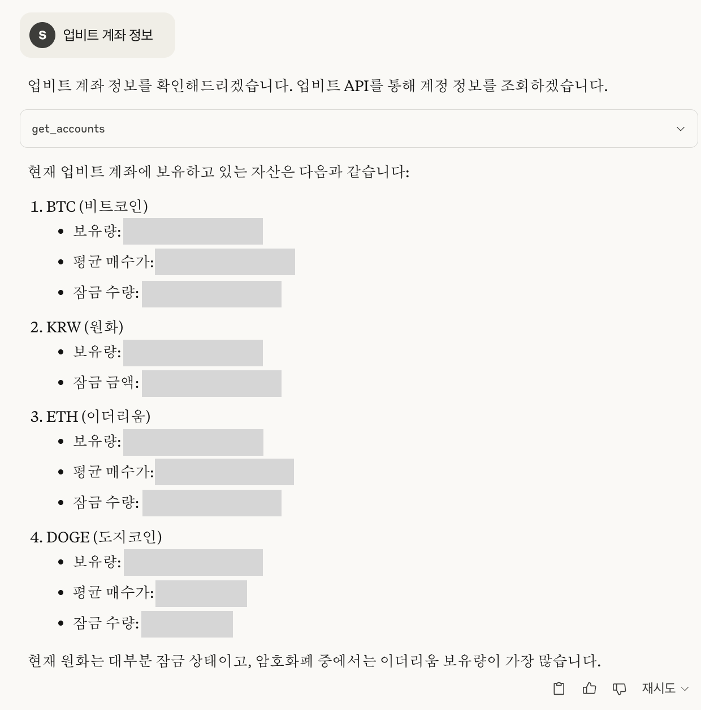

# Upbit MCP 서버

이 프로젝트는 [Upbit](https://upbit.com) 암호화폐 거래소 OpenAPI를 위한 MCP(Model Context Protocol) 서버 구현입니다. Upbit 거래소의 다양한 서비스(시세, 호가창, 체결 내역, 차트 데이터 조회, 계정 정보 확인, 주문 생성 및 취소, 입출금 관리, 기술적 분석 등)와 상호작용할 수 있는 도구들을 제공합니다.

**본 프로젝트는 [solangii/upbit-mcp-server](https://github.com/solangii/upbit-mcp-server)를 기반으로 합니다.**
원본 프로젝트는 MCP stdio 통신 방식으로 설계되어 n8n과 같은 워크플로우 자동화 도구와의 직접적인 연동에 어려움이 있었습니다. 이 버전은 n8n과의 원활한 연동을 위해 SSE(Server-Sent Events)를 지원하도록 핵심 로직이 수정되었으며, Docker 및 Docker Compose를 활용한 배포 방식을 기본으로 제공합니다.

## 주요 기능

- 실시간 시장 데이터 조회 (현재가, 호가창, 최근 체결 내역, 캔들 데이터 등)
- 계정 정보 확인 (전체 잔고, 미체결 주문, 개별 주문 상세, 입출금 내역 등)
- 주문 실행 및 취소 (지정가/시장가 주문, 주문 취소)
- 기술적 분석 지표 및 신호 제공
- LLM 에이전트의 답변 및 행동을 가이드하기 위한 프롬프트 및 리소스 제공
- `FastMCP 1.0.0` 기반의 SSE(Server-Sent Events) 통신 지원으로 n8n 등 외부 시스템과의 유연한 연동

### 제공 툴 (Tools)

본 MCP 서버는 다음과 같은 툴들을 제공하여 LLM 에이전트가 업비트 API와 상호작용할 수 있도록 합니다.

| 툴 이름                      | 기능 설명                                                                 | 주요 파라미터 (예시)      |
| ---------------------------- | ------------------------------------------------------------------------- | ------------------------ |
| `get_ticker`                 | 특정 암호화폐 마켓의 현재 시세 정보(가격, 변동률 등)를 조회합니다.        | `symbol="KRW-BTC"`       |
| `get_orderbook`              | 특정 마켓의 실시간 매수/매도 호가 정보를 조회합니다.                        | `symbol="KRW-BTC"`       |
| `get_trades`                 | 특정 마켓의 가장 최근 단일 체결 내역을 조회합니다. (API 기본값)             | `symbol="KRW-BTC"`       |
| `get_accounts`               | 사용자의 전체 계좌 잔고 및 보유 자산 정보를 조회합니다.                     | -                        |
| `create_order`               | 지정가 또는 시장가로 매수/매도 주문을 생성합니다.                           | `market`, `side`, `ord_type`, `volume`, `price` |
| `get_orders`                 | 사용자의 미체결 주문 목록을 조회합니다.                                     | `market` (선택)          |
| `get_order`                  | 특정 주문의 상세 내역을 조회합니다.                                         | `uuid`                   |
| `cancel_order`               | 특정 주문을 취소합니다.                                                     | `uuid`                   |
| `get_market_summary`         | (현재 `get_ticker`와 유사) 시장 요약 정보를 조회합니다.                     | `symbol="KRW-BTC"`       |
| `get_deposits_withdrawals`   | 사용자의 입출금 내역을 조회합니다.                                          | `currency` (선택)        |
| `technical_analysis`         | 지정된 마켓과 인터벌에 대한 다양한 기술적 지표 및 분석 신호를 제공합니다.     | `market`, `interval`     |
| `dummy_tool`                 | 서버 동작 테스트 및 기본적인 요청/응답 확인을 위한 더미 툴입니다.           | `message`                |

### 제공 프롬프트 (Prompts)

LLM 에이전트가 특정 상황에 더 적절하게 응답하거나 작업을 수행하도록 안내하는 프롬프트 템플릿을 제공합니다.

| 프롬프트 이름          | 기능 설명                                                              |
| ---------------------- | ---------------------------------------------------------------------- |
| `explain_ticker`       | `get_ticker`로 얻은 시세 데이터를 사용자에게 설명하기 위한 텍스트를 생성합니다. |
| `analyze_portfolio`    | `get_accounts`로 얻은 계좌 정보를 바탕으로 포트폴리오 분석을 요청하는 텍스트를 생성합니다. |
| `order_help`           | `create_order` 툴 사용법 및 주문 관련 도움말을 제공합니다.                 |
| `trading_strategy`     | 트레이딩 전략 수립 과정을 안내하고 관련 툴 사용을 유도하는 텍스트를 생성합니다. |

### 제공 리소스 (Resources)

MCP 클라이언트나 LLM 에이전트가 참조할 수 있는 정적 또는 동적 데이터를 제공합니다.

| 리소스 URI        | 제공 데이터                               | 관련 툴/기능           |
| ----------------- | ----------------------------------------- | ---------------------- |
| `market://list`   | 업비트에서 거래 가능한 전체 마켓 코드 목록 | `get_market_list.py` |


## 기술적 분석 도구 상세

`tools/technical_analysis.py` 에서 제공하는 `technical_analysis` 함수는 다음의 기술적 지표 및 분석 정보를 제공합니다.

| 기능 분류 | 세부 지표/항목 | 기본 설정/참고 | 제공 신호 |
|---|---|---|---|
| **캔들 데이터** | 지정된 마켓 및 인터벌의 캔들 조회 | Upbit API 사용 (기본 100개) | - |
| **이동 평균선 (SMA)** | 5, 10, 20, 50일 단순 이동 평균 |  | "상승 추세 (황금 교차)", "하락 추세 (죽음의 교차)", "중립" |
| **상대강도지수 (RSI)** | 14일 RSI |  | "과매수", "과매도", "중립" |
| **볼린저 밴드** | 20일 기준 중간, 상단, 하단 밴드 |  | "과매수 (상단 돌파)", "과매도 (하단 돌파)", "중립 (밴드 내)" |
| **MACD** | MACD 선 (12, 26일), 신호선 (9일), 히스토그램 | EMA 대신 SMA 사용 (간략화) | "매수 신호", "매도 신호", "중립" |
| **스토캐스틱** | %K (14일), %D (3일) | %D는 %K의 3일 SMA (간략화) | "과매수", "과매도", "상승 중", "하락 중", "중립" |
| **거래량 분석** | 평균 거래량 대비 현재 거래량 비율 |  | - |
| **지지/저항** | 피봇 포인트, R1, R2, S1, S2 | 단순화된 계산 방식 | - |
| **종합 분석** | 각 지표 값 반환 |  | - |
| **종합 신호** | 투자 판단 보조 신호 | 여러 지표 신호 종합 | "매수 고려", "매도 고려", "중립 관망" |

**참고:** `technical_analysis` 함수는 `market` (예: "KRW-BTC") 및 `interval` (예: "day", "minute60")을 인자로 받습니다. 제공되는 신호는 투자 결정에 대한 참고 자료이며, 실제 투자는 사용자의 신중한 판단 하에 이루어져야 합니다.

<details>
  <summary><strong>수행 가능한 기능 목록 (세부)</strong></summary>
  <br/>

  <h4>시장 데이터 조회</h4>
  <ul>
    <li>특정 암호화폐의 현재 시세(가격, 변동률 등) 조회 (<code>get_ticker</code>)</li>
    <li>특정 마켓의 실시간 매수/매도 호가 정보 조회 (<code>get_orderbook</code>)</li>
    <li>특정 마켓의 가장 최근 단일 체결 내역 조회 (<code>get_trades</code>)</li>
    <li>(<code>get_market_summary</code>는 현재 <code>get_ticker</code>와 유사 기능 제공 가능성)</li>
    <li>지정된 마켓과 인터벌에 대한 다양한 기술적 지표 및 분석 신호 확인 (<code>technical_analysis</code>)</li>
    <li>업비트 거래 가능 전체 마켓 코드 목록 확인 (<code>market://list</code> 리소스, <code>get_market_list</code>)</li>
  </ul>

  <h4>계정 정보 조회</h4>
  <ul>
    <li>전체 계좌 잔고 및 보유 자산 정보 확인 (<code>get_accounts</code>)</li>
    <li>미체결 주문 목록 조회 (<code>get_orders</code>)</li>
    <li>특정 주문의 상세 내역 조회 (<code>get_order</code>)</li>
    <li>입출금 내역 조회 (<code>get_deposits_withdrawals</code>)</li>
  </ul>

  <h4>거래 기능</h4>
  <ul>
    <li>지정가 또는 시장가 매수/매도 주문 생성 (<code>create_order</code>)</li>
    <li>특정 주문 취소 (<code>cancel_order</code>)</li>
  </ul>

  <h4>LLM 에이전트 보조</h4>
  <ul>
    <li>시세 정보 사용자 설명 생성 (<code>explain_ticker</code> 프롬프트)</li>
    <li>포트폴리오 분석 요청 생성 (<code>analyze_portfolio</code> 프롬프트)</li>
    <li>주문 방법 안내 (<code>order_help</code> 프롬프트)</li>
    <li>트레이딩 전략 수립 가이드 (<code>trading_strategy</code> 프롬프트)</li>
  </ul>
</details>

<details>
  <summary><strong>채팅 예시 (원본 프로젝트 기준)</strong></summary>
  <br/>
  <p>
    아래는 원본 프로젝트([solangii/upbit-mcp-server](https://github.com/solangii/upbit-mcp-server))의 채팅 예시 이미지입니다.
  </p>
  
  
</details>

## 프로젝트 구조

프로젝트의 주요 디렉토리 및 파일은 다음과 같습니다:

-   `main.py`: FastMCP 서버의 메인 실행 파일입니다. 모든 툴, 프롬프트, 리소스를 초기화하고 서버를 실행합니다.
-   `config.py`: Upbit API 키, 기본 API URL 등의 설정을 관리합니다. (실제 키는 `.env` 파일에 저장)
-   `docker-compose.yml`: Docker를 사용하여 서버를 빌드하고 실행하기 위한 설정 파일입니다. n8n과의 네트워크 연동 설정 등이 포함됩니다.
-   `requirements.txt` / `pyproject.toml` / `uv.lock`: Python 프로젝트의 의존성 패키지들을 관리합니다. (`uv` 사용 권장)
-   `.env`: Upbit API 키와 같이 민감한 환경 변수를 저장하는 파일입니다. (버전 관리에서 제외됨)
-   `tools/`: 업비트 API 기능을 수행하는 개별 MCP 툴 파이썬 파일들이 위치합니다. (예: `get_ticker.py`, `create_order.py`)
-   `prompts/`: LLM 에이전트의 행동을 가이드하거나 특정 작업 템플릿을 제공하는 프롬프트 파이썬 파일들이 위치합니다. (예: `order_help.py`)
-   `resources/`: MCP 서버가 제공하는 리소스(예: 거래 가능 마켓 목록)를 정의하는 파이썬 파일들이 위치합니다. (예: `get_market_list.py`)
-   `README.md`: 본 프로젝트 설명 파일입니다.

## 사전 준비 사항

시작하기 전에 Upbit API 키를 발급받아야 합니다:

1. [Upbit](https://upbit.com)에 계정이 없다면 먼저 회원가입을 진행합니다.
2. [Upbit 개발자 센터](https://upbit.com/service_center/open_api_guide)로 이동합니다.
3. 새로운 API 키를 생성합니다.
4. API 키에 필요한 권한(조회, 주문, 출금 등)을 적절히 설정합니다.
5. 발급받은 API 키(`UPBIT_ACCESS_KEY`, `UPBIT_SECRET_KEY`)를 프로젝트 루트 디렉토리에 `.env` 파일로 저장합니다 (설치 섹션 참조).

## 설치 방법

1.  **저장소 복제:**
    ```bash
    git clone <현재_프로젝트_저장소_URL> # 이 부분은 실제 저장소 URL로 변경해주세요.
    cd upbit-mcp-server
    ```

2.  **의존성 패키지 설치:**
    `uv`를 사용하여 Python 프로젝트에 필요한 패키지들을 설치하는 것을 권장합니다. `uv`는 기존 `pip` 및 `venv`보다 빠르고 효율적인 패키지 관리를 제공합니다.

    만약 `uv`가 설치되어 있지 않다면, 다음 방법으로 먼저 설치해주세요:
    ```bash
    # uv 설치 (Linux, macOS)
    curl -Ls https://astral.sh/uv/install.sh | sh
    
    # 설치 후, 터미널 환경에 맞게 PATH 설정을 업데이트해야 할 수 있습니다.
    # (예: 쉘 설정 파일(~/.bashrc, ~/.zshrc 등)에 export PATH="$HOME/.astral/bin:$PATH" 추가 후 source ~/.bashrc 또는 터미널 재시작)
    ```

    `uv` 설치 후, 프로젝트 루트 디렉토리에서 다음 명령을 실행하여 의존성을 설치합니다:
    ```bash
    uv sync
    ```
    
    (*대안: 기존 `pip` 사용 시*)
    ```bash
    # python3 -m venv .venv  # 가상환경 생성 (필요시)
    # source .venv/bin/activate # 가상환경 활성화 (필요시)
    # pip install -r requirements.txt
    ```

3.  **환경 변수 설정:**
    프로젝트 루트 디렉토리에 `.env` 파일을 생성하고, 발급받은 Upbit API 키를 다음과 같이 입력합니다:
    ```env
    UPBIT_ACCESS_KEY=여기에_발급받은_ACCESS_KEY를_입력하세요
    UPBIT_SECRET_KEY=여기에_발급받은_SECRET_KEY를_입력하세요
    ```

## 사용 방법

이 서버는 n8n과의 원활한 연동을 위해 Docker Compose를 사용하여 실행하는 것을 권장합니다.

### Docker Compose를 이용한 실행 (n8n 연동 권장)

1.  **`docker-compose.yml` 설정 확인:**
    프로젝트에 포함된 `docker-compose.yml` 파일은 Upbit MCP 서버를 빌드하고 실행하도록 구성되어 있습니다. 주요 설정은 다음과 같습니다:
    *   **`ports`**: 서버의 포트(예: `8001:8001`)를 호스트 머신에 노출시킵니다. 이는 n8n이 (호스트나 다른 Docker 네트워크에서 실행 중일 경우) 서버에 접속할 수 있게 합니다.
    *   **`networks`**: 서버를 특정 Docker 네트워크(예: `nginx-n8n-net`)에 연결합니다. n8n과 이 서버가 모두 동일한 Docker 네트워크 상에서 컨테이너로 실행될 때 서로 통신하기 위해 **매우 중요합니다.** 사용 중인 n8n 컨테이너가 연결된 Docker 네트워크 이름과 동일하게 설정하거나, 필요한 경우 `docker-compose.yml` 파일 내의 `networks` 섹션을 직접 수정하십시오. (예: `nginx-n8n-net` -> 사용자의 n8n 네트워크 이름)
    *   **`env_file`**: `.env` 파일로부터 환경 변수를 로드합니다.
    *   **`volumes`**: 현재 디렉토리를 컨테이너 내부에 마운트하여, 이미지 재빌드 없이 코드 변경사항을 반영할 수 있게 합니다 (개발 시 유용).

2.  **서버 시작:**
    ```bash
    docker-compose up -d --build
    ```

3.  **로그 확인:**
    ```bash
    docker-compose logs -f upbit-mcp-server
    ```

### n8n 연동 설정

위 설명대로 Upbit MCP 서버가 Docker Compose를 통해 실행되고 n8n 인스턴스와 동일한 Docker 네트워크에 연결되었다면, 다음과 같이 n8n 워크플로우를 설정합니다:

1.  n8n 워크플로우에서 HTTP Request 노드 또는 MCP 관련 커뮤니티 노드(사용 가능하다면)를 사용합니다.
2.  **SSE 엔드포인트 URL**을 `http://upbit_mcp_server:8001/sse`로 설정합니다.
    *   `upbit_mcp_server`: `docker-compose.yml`에 정의된 서비스 이름입니다. Docker 내부 DNS가 이 이름을 공유 네트워크 내의 올바른 컨테이너 IP로 해석합니다.
    *   `8001`: 컨테이너 내부에서 서버가 리스닝하는 포트입니다. (호스트 포트와 동일하게 매핑된 경우)
    *   `/sse`: `FastMCP` 라이브러리에서 SSE 스트림을 위해 사용하는 일반적인 경로입니다. 만약 루트 경로(`/`)로 요청 시 `404 Not Found` 오류가 발생하면, `/sse` 경로를 사용해보세요.
    *   만약 n8n이 Docker 외부(예: 로컬 머신)에서 실행되고 MCP 서버만 Docker로 실행 중이라면, URL은 `http://localhost:8001/sse` (또는 Docker 호스트의 IP와 노출된 포트)가 됩니다.

### 개발 서버 실행 (Docker 미사용, 직접 테스트용)

개발 또는 직접 테스트 목적으로 Docker 없이 서버를 실행할 수 있습니다:
```bash
uv run python main.py
```
또는 FastMCP의 개발 모드를 사용할 수 있습니다:
```bash
fastmcp dev main.py
```
주의: 이 방법으로 직접 실행 시, n8n 인스턴스가 서버가 실행 중인 호스트와 포트로 접근할 수 있어야 합니다. n8n 연동 시에는 일반적으로 Docker를 사용하는 것이 더 편리하고 안정적입니다.

## LLM 에이전트 연동 가이드

이 MCP 서버는 LLM(Large Language Model) 기반 에이전트와 효과적으로 연동되도록 설계되었습니다. 에이전트가 본 서버의 기능을 최대한 활용하기 위한 몇 가지 가이드라인은 다음과 같습니다.

### 1. 툴(Tool) 사용 이해

-   **목적 숙지**: 위에 설명된 각 툴의 목적, 필요한 파라미터, 반환 값을 LLM이 정확히 이해해야 합니다. 이는 시스템 프롬프트나 별도의 툴 사용 가이드 문서를 통해 LLM에게 제공될 수 있습니다.
-   **파라미터 추출**: 사용자의 자연어 질문에서 각 툴에 필요한 파라미터를 정확히 추출하는 능력이 중요합니다. 예를 들어, "비트코인 현재가 알려줘"에서 `get_ticker` 툴의 `symbol` 파라미터 값으로 "KRW-BTC"를 추론해야 합니다.
-   **적절한 툴 선택**: 사용자의 요청 의도에 가장 적합한 툴을 선택해야 합니다. 예를 들어, "비트코인 가격"은 `get_ticker`를, "비트코인 최근 체결 기록"은 `get_trades`를 사용하도록 구분해야 합니다.
-   **오류 처리**: 툴 실행 중 오류가 발생하면 (예: `UserError` 발생), LLM은 해당 오류 메시지를 사용자에게 친절하게 전달하고, 필요한 경우 추가 정보를 요청하거나 대안적인 행동을 제안해야 합니다.

### 2. 프롬프트(Prompt) 활용

-   제공되는 프롬프트들(`explain_ticker`, `analyze_portfolio`, `order_help`, `trading_strategy`)은 LLM이 특정 작업을 수행하거나 사용자에게 정보를 제공하는 방식을 표준화하고 질을 높이는 데 도움을 줍니다.
-   예를 들어, `get_ticker`로 시세 정보를 얻은 후, `explain_ticker` 프롬프트를 활용하여 사용자에게 더 이해하기 쉬운 형태로 정보를 가공하여 전달할 수 있습니다.
-   `order_help` 프롬프트는 사용자가 주문 방법을 문의할 때 일관되고 정확한 정보를 제공하는 데 사용될 수 있습니다.

### 3. 리소스(Resource) 활용

-   `market://list` 리소스는 업비트에서 거래 가능한 전체 마켓 코드 목록을 제공합니다. LLM은 이 정보를 활용하여 사용자에게 거래 가능한 코인 목록을 안내하거나, 특정 코인이 거래 가능한지 확인할 수 있습니다.

### 4. 일반적인 상호작용 흐름

1.  **사용자 요청 분석**: LLM은 사용자의 자연어 요청을 이해하고 핵심 의도를 파악합니다.
2.  **툴/프롬프트/리소스 선택**: 요청을 처리하기 위해 가장 적합한 툴, 프롬프트, 또는 리소스를 선택합니다.
3.  **툴 실행 (필요시)**: 선택된 툴에 필요한 파라미터를 구성하여 MCP 서버에 실행을 요청합니다.
4.  **결과 처리 및 응답 생성**: 툴 실행 결과 또는 프롬프트/리소스 내용을 바탕으로 사용자에게 전달할 최종 응답을 생성합니다. 오류가 발생했거나 정보가 부족한 경우, 적절한 피드백을 제공합니다.

**권장 사항**: LLM 에이전트의 시스템 프롬프트에 이 MCP 서버의 전반적인 기능, 주요 툴 목록 및 사용법에 대한 요약을 포함시키면, 에이전트가 더욱 효과적으로 서버와 상호작용할 수 있습니다. (각 툴별 상세 프롬프트는 별도 관리하거나, 필요시 시스템 프롬프트에 핵심만 요약하여 추가)

## 주의 사항

-   이 서버는 실제 거래를 처리할 수 있으므로 주의해서 사용해야 합니다.
-   API 키를 안전하게 보관하고, 절대로 공개 저장소에 커밋하지 마십시오.

## 라이선스

MIT
